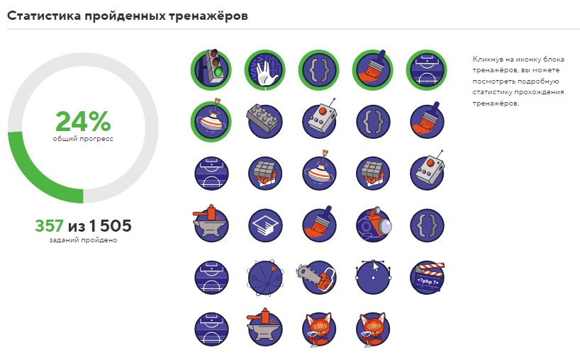

# Давыденко Иван

## Контактная информация
```
Телефон: 8 (950) 027 08 66
E-mail: vanohata@mail.ru
Telegram: https://t.me/d_onex (@donex)
```

## Обо мне

**Опыт работ:** Релевантного опыта работы в программировани на данный момент нет. Есть только большое желание переквалифицироваться в *Frontend-разработчика*. В июле 2024 года начал проходить курс по *HTML/CSS* в **HTML Academy**, также там начал изучать JS, но знакомые, которые работают в программировании, сказали, что его там изучать нет смысла, поскольку оно не юзабильно в работе.

**Как узнал о курсе:** Друг посоветовал поступить в **RS school** для изучения, поскольку тут дают качественные знания и сразу нарабатывается опыт в отличии от большинства других курсов и вот я тут. Но к шагу ноль я подключился в конце августа и ольшую часть вещей уже пропустил.

**Планы:** Сейчас работаю **SEO-специалистом** уже более 3х лет. За это время я смог для себя определить желаемое направление развития и планирую развиваться и стримиться к званию Frontend-разработчика.

## Навыки
Есть базовое понимание *HTML/CSS*. Трезво оценивая навыки, могу сказать, что нужно значительно улучшить понимание и умение использовать *CSS*, что планирую улучшить на этом курсе, в **HTML Academy** и по видео гайдам с **YouTube**.

Сейчас изучаю **Git** и **VSC**, для прохождения курса и будущей работы (Не забываю и про **HTML, CSS и JS**).

## Пример кода

Пример кода из курса **HTML Academy**. 

Какую задачу решал код: Было реализовано поле, где каждая ячейка явлеятся пикселем и пользователь мог в ней рисовать. Выбирая из списка определенный цвет и нажимая на поле он должен был закрашивать выбранную ячейку. Также была реализована кнопка *очистить*, которая должна была очещать все поле.

Сам код для решения этой задачи:

```javascript
let pixels = document.querySelectorAll('.pixel');
let chosenColor = document.querySelector('.chosen-color');
let eraser = document.querySelector('.eraser');

for (let pixel of pixels) {
pixel.onclick = function () {
  if (eraser.checked) {
  pixel.style.backgroundColor = 'white';
  } else {   
  let chosenColorValue = chosenColor.value;
  pixel.style.backgroundColor = chosenColorValue;
  };
 };
};
```

Другой пример решения задачи из **HTML Academy**. Реализация функционала экранной клавиатуры:

```javascript
let keys = document.querySelectorAll('.key');
let display = document.querySelector('.display');
let clear = document.querySelector('.clear');

for (let key of keys) {
    display.textContent = display.textContent + key.textContent;
    console.log(key);
};
clear.onclick = function () {
    dislay.textContent = " ";
    console.log(clear);
};
```

Пример из **Codewars**:

```javascript
function betterThanAverage(classPoints, yourPoints) {
  return yourPoints > classPoints.reduce((a, b) => a + b, 0) / classPoints.length; 
}
```

*данный пример не отражает реальные навыки, к сожалению пришлось искать способы решения в интернете.*

## Опыт работы

Релевантного опыта нет.

## Образование

Прохожу тренажеры в **HTML Academy**. Результаты на момент составления резюме:



## Языки

* Русский - основной;
* Английский - А1.